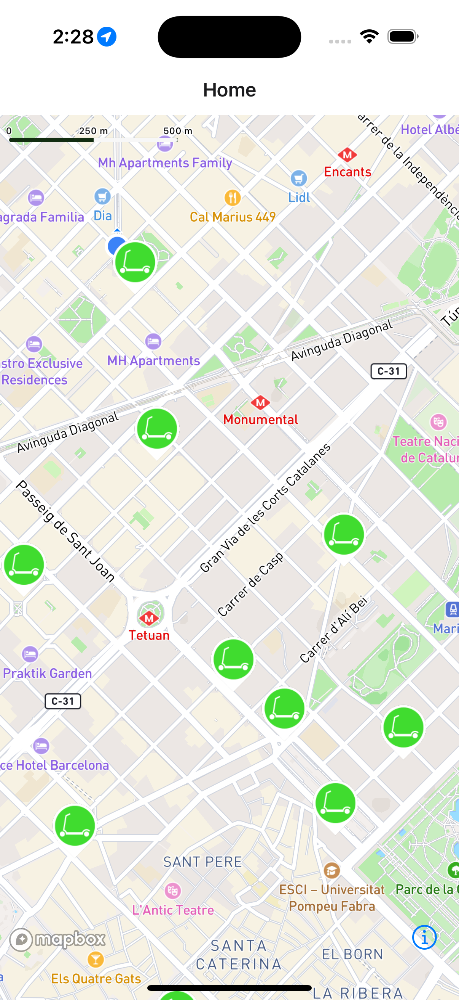

## Scooters

Uses mapbox to draw a map
showing the location of scooters.
Select a scooter to find the shortest
path

npm install  
npx expo run ios  
npx expo run android

you will need to create a .env file
you will need a mapbox accout to do this

EXPO_PUBLIC_MAPBOX_KEY=<mapbox secret token>
